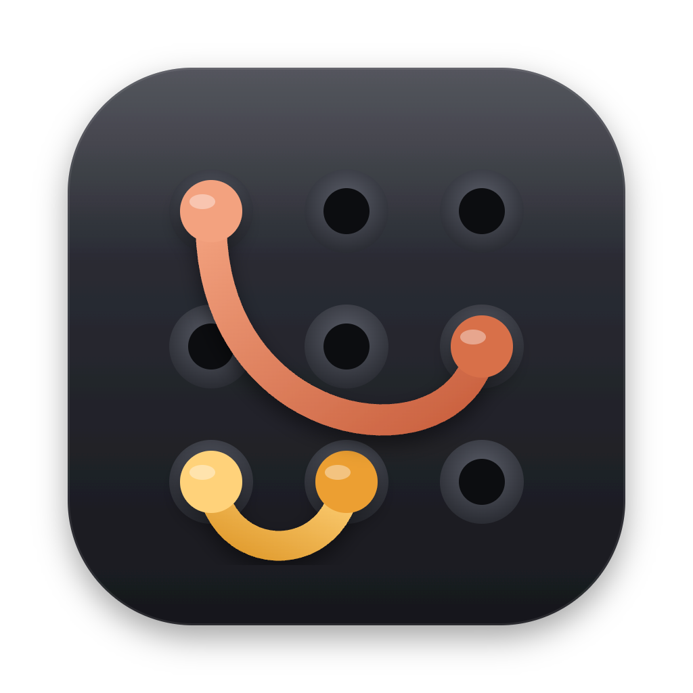
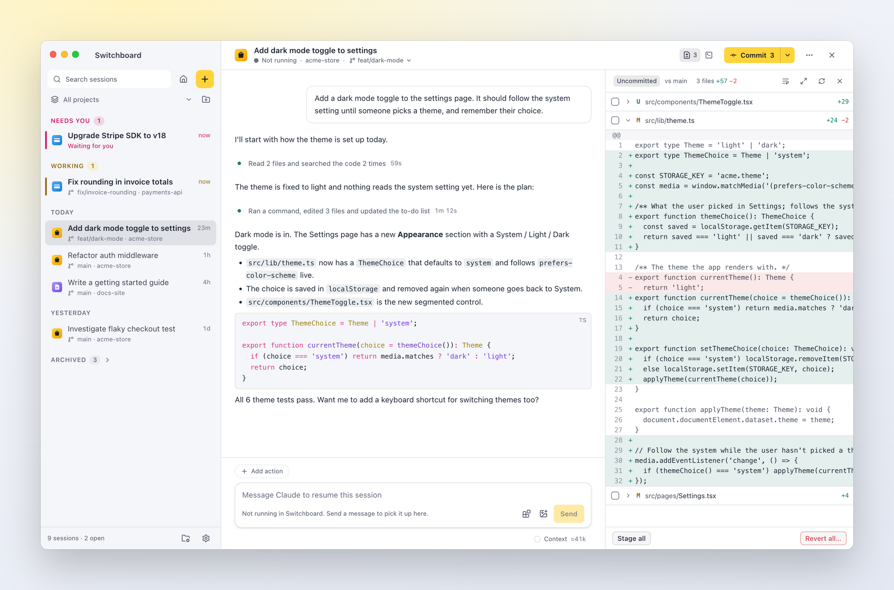
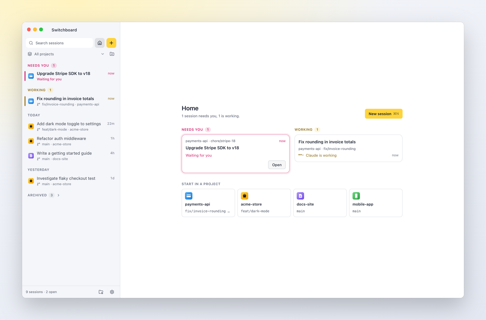
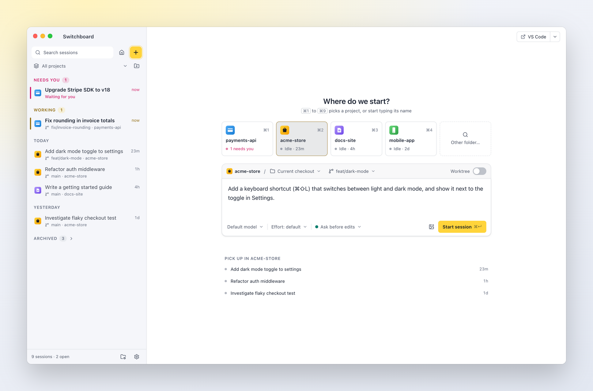
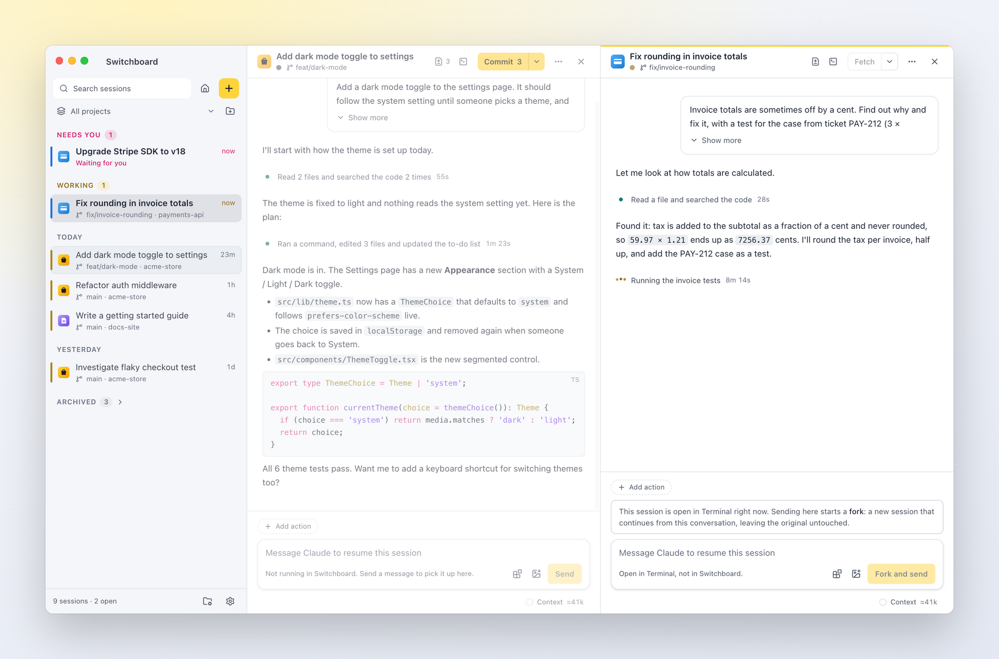
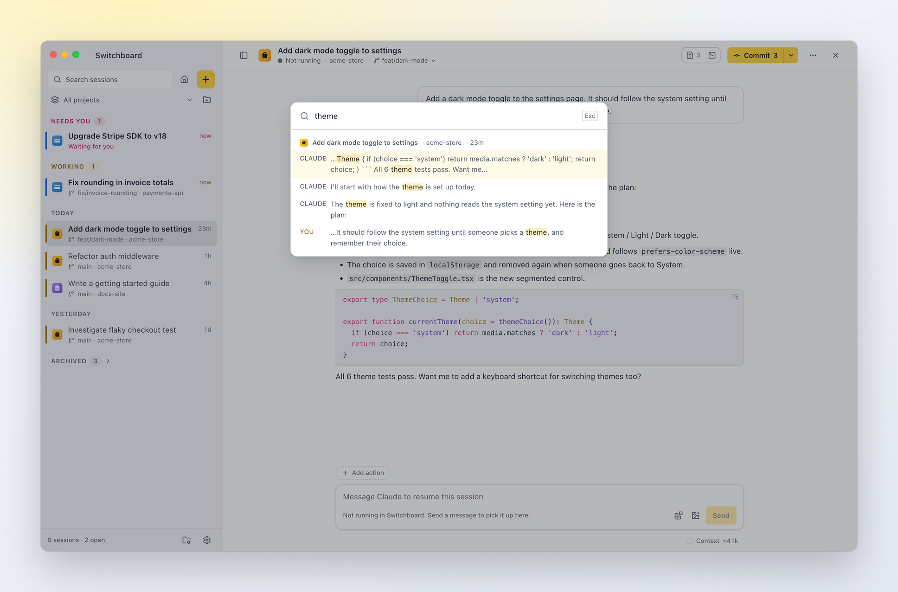
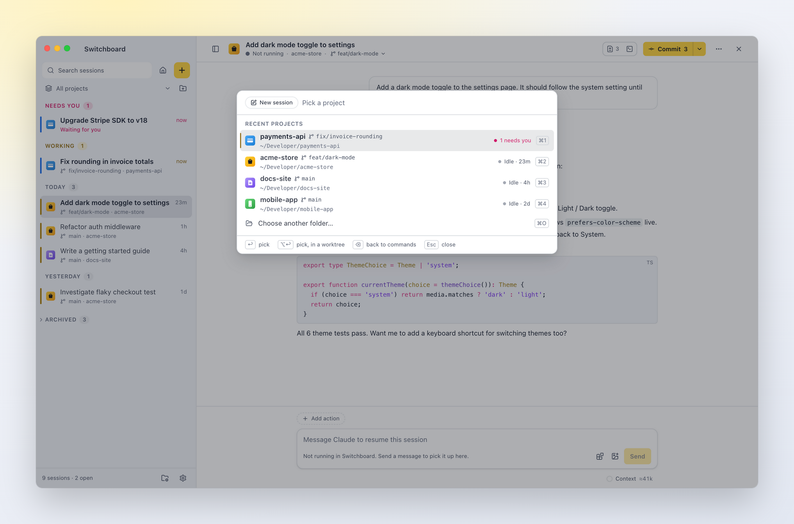
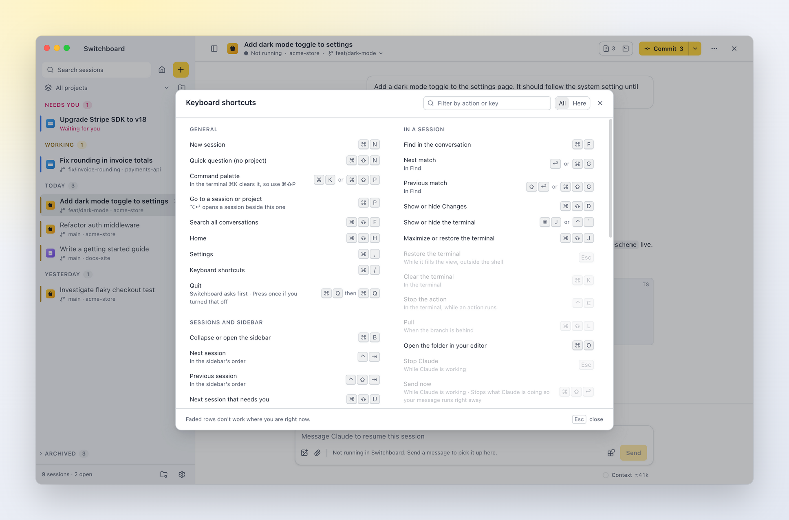

<p align="center">
  
</p>

<h1 align="center">Switchboard</h1>

<p align="center">A fast Mac app for running and keeping track of your Claude Code sessions, across all your Claude accounts.</p>

<p align="center">
  <a href="https://visitorbadge.io/status?path=https%3A%2F%2Fgithub.com%2Festruyf%2Fswitchboard"></a>
</p>

Switchboard puts all your Claude Code sessions in one window: the ones you start in the app, and the ones running in your terminal. Start new sessions, see at a glance which ones are working or waiting for you, approve permissions, and pick up any past conversation where you left off.

It uses the Claude Code you already have installed, with your login, settings, commands and skills. Nothing extra to sign in to. Use more than one Claude account, like a personal plan and a work one? Add each as a profile and see all their sessions in the same list.

<picture>
  <source media="(prefers-color-scheme: dark)" srcset="docs/screenshots/session-dark.png">
  
</picture>

## What you can do

**Keep track of every session**
- One list of all your sessions, newest first, across every project. Sessions you haven't touched for a while move to **Archived**, out of the way. You can archive one yourself too, even while it works: it comes back when it needs you or has finished. Nothing is deleted; to remove a session for good, delete it (it goes to the Trash).
- Select several sessions with ⌘-click or ⇧-click to archive or unarchive them together.
- See at a glance which sessions are **working**, **waiting for you**, **finished** or **unread**.
- Filter by one of your projects, filter by title, and pin the sessions you keep coming back to.
- Close a section of the sidebar (Working, Queue, Pinned, Today, Yesterday, Earlier) by clicking its header, or ← and → on it; ⌥-click closes or opens them all. A closed section keeps its count and says what's unread, and the session you have open stays visible under it.
- **Search every conversation** (⌘⇧F): your prompts and Claude's replies across all sessions, with the matching words highlighted. Pick a result to jump straight to that message.
- **Find in a conversation** (⌘F): every match in the session you're reading is highlighted; ↩ and ⇧↩ step through them.
- Give each project an icon. Switchboard picks one up from the repo when it can (a logo or favicon).
- Sessions running in your terminal show up too, live.
- **Several Claude accounts** in one list: add a [Claude profile](#settings) for each login (a personal plan and a work one, say). Each session shows which account it runs on, and Home shows what each one is doing.

**Work with Claude**
- Start a session in a folder (⌘N): pick a project by typing a few letters, then work on the current branch (or check out another one first) or in a **new worktree**, just like `claude --worktree`.
- **Quick questions** (⌘⇧N): ask Claude something without picking a project. Choose *Quick question* under the project tiles in New session. Claude works in a scratch folder of Switchboard's own, so there are no git options and nothing is added to your projects. These sessions show as *Questions* in the sidebar.
- **Projects** are the folders you choose to work in. Add them from the folders you've used Claude Code in, or any folder, then reorder, rename or remove them in the **Projects** view (the folder icon at the bottom of the sidebar). Renaming only changes the name Switchboard shows; the folder keeps its own. Give a project its own defaults for new sessions: model, effort, permission mode, worktree or current folder, and a branch. The New session view starts from them; change something there for one session, or click *Save as project default*.
- Chat as you would in the terminal. You get streaming replies, `/` commands (your own commands and skills included), `@` file mentions, and images you paste, drop or attach. Drag files anywhere over a session and the message box shows what a drop does: images are attached, other files and folders are added as context.
- **Context** shows as chips above the message: files you drop, pick from the `@` list, or choose several at once with **Add context** (⌘⇧A, or the paperclip). Remove one with its ×. Files go to Claude as references it reads itself, so a large file stays small. With the [VS Code companion](#vs-code-companion) you can send the lines you have selected in VS Code, problems and terminal output too.
- Approve or deny permission requests, answer Claude's questions and review plans in the conversation.
- Follow what Claude does without the noise: each run of tool calls is one line ("Reading src/app.ts…", then "Ran 3 commands and edited 2 files"), and a click shows every step, with diffs, command output, to-do lists and subagent runs.
- Images Claude reads or you attach are shown in the conversation.
- Press **Esc** (or **Stop**) to stop Claude, **⇧Tab** to switch permission mode, and keep typing while it works (messages queue up). **Stop session** under **⋯** in the header ends the Claude Code process; sending a message picks it up again.
- Change the model, permission mode and **effort** while a session runs, from the chips in the message box, and see how full the **context window** is under it. Click it for what fills it, like `/context`, and to compact the conversation.
- **Agents** Claude starts, background ones included, are under **⋯** in the session header ("2 running"; a dot on **⋯** says some are); pick **Agents** to watch what each one is doing.
- Continue any past session. If it's still open in a terminal, Switchboard offers to **fork** it instead, leaving the original untouched.
- Hover over a message to go back in time:
  - **Undo file changes** since one of your prompts. You see which files would change first.
  - **Edit and resend** a prompt, in a new session.
  - **Fork** from any of Claude's replies.
- **Copy** any message from the same hover toolbar: your prompts and commands as you typed them, Claude's replies as Markdown. You can also select text in any message and press ⌘C.

**Stay on top of things**
- A notification and Dock badge when a session needs you or finishes, so you can leave it running in the background.
- A **queue** of prompts to start next, each one saying when it's ready (when its project is free). See [Queue](#queue).
- **Unsent messages** are kept, also after you quit. See [Unsent messages](#unsent-messages).
- An optional **focus limit**: how many sessions you want going at the same time, so starting another doesn't come at the cost of the ones already running. See [Focus limit](#focus-limit).
- Your plan usage under the message box: how much of your 5-hour and weekly limits you've used (hover for when they reset).

**Review and finish the work**
- A **Changes** panel (⌘⇧D) with the session's git diff: what's uncommitted, or the whole branch compared with `main`. Stage, unstage or revert files, and open any diff inline. Reverted new files go to the Trash.
- The **branch** a session's folder has checked out shows in its header, read live from git (so it's right after you or Claude switch in a terminal). Click it (or **Switch branch…** in the git menu) to switch to another local branch. Switching uses `git switch`: uncommitted changes that don't conflict come along, and when they would be overwritten git refuses and you stay where you are. Nothing is ever stashed or thrown away. It waits while Claude is working in this folder, and asks first when other sessions work in the same folder.
- A **git button** in the session header offers the next step for the branch: **Pull ↓2** when it's behind its upstream, **Commit 3** when there are changes (Claude writes the commit), **Push ↑1**, **Create PR** once a branch or worktree is pushed, otherwise **Fetch**. Its menu shows where the branch stands (behind, ahead, changed files) and has every step: Pull (⌘⇧L), Fetch, **Commit…** with your own message, Ask Claude to commit, Push and Create PR, plus **Switch branch…** and **New worktree…**. It says when you need to pull before you push. Git runs in a terminal tab so you see its output; pull requests open GitHub's page with the GitHub CLI (`gh`). Pull and commit wait while Claude is working in the folder.
- **Finish a worktree** from its **Worktree** menu: merge into the base branch, or remove the worktree, optionally with its branch. Switchboard warns you before you lose commits that aren't merged or pushed.

**Everything in one place**
- A **command palette**: ⌘K (or ⌘⇧P) for the commands that fit where you are, ⌘P to jump to any session or project by typing a few letters. Start a session from it without leaving the keyboard: pick a project, write the prompt, press ⌘↵.
- **Two sessions side by side**: ⌥-click a session (or choose *Open beside*) to open it next to the current one.
- **Home** (⌘⇧H, or the house button at the top of the sidebar) shows what needs you, what is working, and your projects. **Close a session** with the × in its header to go back to Home. A session that is working keeps running; pick it in the sidebar to open it again.
- **Tools** (below the message box): the session's MCP servers, with their status and tools (turn them on or off, or reconnect, while the session runs in Switchboard), plus its skills, commands, agents and plugins.
- A built-in terminal per session: ⌘J (or **Terminal** in the header) opens a shell in the session's folder. **⋯ → Open in → Claude Code** opens the session in the full Claude Code terminal interface.
- **Project actions**: one-click buttons for things like *Commit*, *Test* or *Publish*, running a command or sending Claude a prompt. See [Project actions](docs/project-actions.md).
- **Open in** your editor, terminal or Finder (⌘O), or on GitHub, and click any file path in the conversation to open it at that line.
- **Continue in VS Code** (under **⋯** in the session header): stops the session in Switchboard and opens it in Claude Code's VS Code extension, in the window for its folder.
- **Links** that open Switchboard: `switchboard://new-session?project=payments&prompt=…` (or `cwd=/path`, or `repo=owner/name`) opens New session with the project and prompt filled in, and `switchboard://session/<id>` opens a session. Put them in runbooks, alerts, READMEs or Raycast and Alfred scripts. By default you read the prompt and press Enter; add `autostart=1` to start right away, or `question=1` for a quick question without a project. See [Links](docs/deep-links.md).
- Delete sessions you don't need. They go to the Trash, so you can get them back.

<table>
  <tr>
    <td width="50%"><picture>
  <source media="(prefers-color-scheme: dark)" srcset="docs/screenshots/home-dark.png">
  
</picture><br><b>Home</b>: what needs you, what is working, your projects and your Claude profiles.</td>
    <td width="50%"><picture>
  <source media="(prefers-color-scheme: dark)" srcset="docs/screenshots/new-session-dark.png">
  
</picture><br><b>New session</b> (⌘N): pick a project, then work on a branch or in a new worktree.</td>
  </tr>
  <tr>
    <td width="50%"><picture>
  <source media="(prefers-color-scheme: dark)" srcset="docs/screenshots/split-dark.png">
  
</picture><br><b>Side by side</b>: ⌥-click a session to open it next to the current one.</td>
    <td width="50%"><picture>
  <source media="(prefers-color-scheme: dark)" srcset="docs/screenshots/search-dark.png">
  
</picture><br><b>Search every conversation</b> (⌘⇧F) and jump straight to the message.</td>
  </tr>
  <tr>
    <td colspan="2" align="center"><picture>
  <source media="(prefers-color-scheme: dark)" srcset="docs/screenshots/palette-dark.png">
  
</picture><br><b>Command palette</b> (⌘K): the commands for where you are, and a new session without leaving the keyboard: pick a project, write the prompt, ⌘↵.</td>
  </tr>
</table>

## Requirements

- A Mac with Apple Silicon
- [Claude Code](https://github.com/anthropics/claude-code) installed and signed in (`claude` works in your terminal)

Switchboard also runs on Windows 10 and 11, built from source for now: there is no Windows installer yet. See [Windows support](docs/windows-support.md).

## Install

Download the `.dmg` from the [latest release](https://github.com/estruyf/switchboard/releases/latest), open it and drag Switchboard to Applications.

Or install it with [Homebrew](https://brew.sh):

```bash
brew install --cask estruyf/tap/switchboard
```

Switchboard updates itself, so `brew upgrade` skips it; `brew upgrade --cask estruyf/tap/switchboard` updates it through Homebrew instead.

Or build it from this repository, which takes a couple of minutes. You need Node 24 or later.

```bash
npm install
npm run dist
```

Then open `apps/desktop/dist/Switchboard-<version>-arm64.dmg` and drag Switchboard to Applications.

If macOS blocks the app the first time you open it, see [Building, signing and notarisation](docs/building-and-signing.md).

### Updates

Switchboard checks for a new release shortly after it opens and every few hours. When there is one, a message in the bottom right corner of the window says so: click **Download** (**What's new** shows the release notes), then **Restart to update**. Close it to decide later; it comes back for the next step or the next time you open Switchboard. If sessions are running, Switchboard asks before it restarts. You can also choose **Switchboard → Check for Updates…** at any time.

In **Settings → About** you can turn automatic checks off and pick a channel: *Stable* (published releases, the default) or *Nightly* (pre-release builds, when there are any). Nothing downloads until you click. Builds you make yourself with `npm run dist` update like a release; development builds don't update.

#### Claude Code

Switchboard also checks whether the Claude Code it runs is up to date: shortly after it opens, every few hours, and when you choose **Check for Updates** under Claude Code in **Settings → About** (or *Check for Claude Code updates…* in the command palette). It compares your version with the newest on the channel you follow: the `autoUpdatesChannel` in your Claude Code settings (*latest* or *stable*), or, for Homebrew, the cask you installed (`claude-code` is stable, `claude-code@latest` is latest).

When a newer version is out, the bottom of the sidebar says so. Click it to update, or dismiss it until the next version. Switchboard runs the update for how you installed Claude Code (`claude update` for the native installer, `brew upgrade --cask …` for Homebrew, `npm install -g …` for npm) and shows its output in Settings → About. New sessions use the new version straight away; sessions already running keep theirs until they restart. If Switchboard can't tell how Claude Code was installed, it shows the command to run in a terminal instead, with a copy button.

To stop the checks, turn off *Check for Claude Code updates automatically* in Settings → About. If you turned off Claude Code's own updater (`DISABLE_AUTOUPDATER`), Settings still shows a newer version, but the sidebar doesn't.

## Getting started

1. **Open Switchboard.** The sidebar lists the sessions you start or continue in Switchboard. To see your sessions from the terminal, Claude desktop and your editor too, turn on *Show sessions from other apps* in Settings.
2. **Pick a session** to read it, or type below it to continue.
3. **Start something new** with ⌘N: pick the project, write what Claude should work on, and choose where it runs: this checkout or a new worktree. Model, permission mode and effort are chips inside the message box, as they are in a session.
4. When a session needs you (a permission or a question), it's marked in the sidebar and you get a notification.

## Keyboard shortcuts

Press **⌘/** (or Help › Keyboard Shortcuts) to see every shortcut in the app, with the ones that work where you are and your project actions' shortcuts. Type in its field to filter by name or by keys ("terminal", "⌘J").

On Windows, ⌘ is Ctrl, ⌥ is Alt and ⇧ is Shift, and the app shows them that way. In the terminal panel, Ctrl keys belong to the shell and Ctrl+Shift keys to Switchboard.

<p align="center"><picture>
  <source media="(prefers-color-scheme: dark)" srcset="docs/screenshots/shortcuts-dark.png">
  
</picture></p>

<!-- shortcuts:start (written by npm run docs:shortcuts from apps/ui/src/lib/shortcuts.ts; edit the registry, not this table) -->

**General**

| Shortcut | What it does |
|---|---|
| ⌘N | New session |
| ⌘⇧N | Quick question (no project) |
| ⌘K or ⌘⇧P | Command palette (in the terminal ⌘K clears it, so use ⌘⇧P) |
| ⌘P | Go to a session or project (⌥↩ opens a session beside this one) |
| ⌘⇧F | Search all conversations |
| ⌘⇧H | Home |
| ⌘, | Settings |
| ⌘/ | Keyboard shortcuts |
| ⌘Q then ⌘Q | Quit (Switchboard asks first; Press once if you turned that off) |

**Sessions and sidebar**

| Shortcut | What it does |
|---|---|
| ⌘B | Collapse or open the sidebar |
| ⌃⇥ | Next session (in the sidebar's order) |
| ⌃⇧⇥ | Previous session (in the sidebar's order) |
| ⌘⇧U | Next session that needs you |
| ↑ or ↓ | Move through sessions (in the sidebar) |
| ⌘-click or ⇧-click or ⇧↑ or ⇧↓ | Select several sessions (in the sidebar) |
| ⌘A | Select every session in the group (in the sidebar) |
| Esc | Clear the selection (while sessions are selected) |
| F2 | Rename the session (in the sidebar) |
| ⌘⌫ | Delete the session (in the sidebar, to the Trash) |
| ⌥-click | Open beside the current session (in the sidebar) |
| Middle-click | Archive a finished session (in the sidebar) |
| ← or → | Close or open a section (on a section header in the sidebar) |
| ⌥-click | Close or open every section (on a section header in the sidebar) |
| ⌘↩ | Start a queued item now (on a queued item, in the sidebar or Home) |
| ⌘E | Edit a queued item in New session (on a queued item, in the sidebar or Home) |
| ⌥↑ or ⌥↓ | Move a queued item up or down (on a queued item, in the sidebar or Home) |
| ⌥⇧↑ | Move a queued item to the top (on a queued item, in the sidebar or Home) |
| ⌫ | Remove a queued item (on a queued item, in the sidebar or Home; Undo puts it back) |
| ⇧F10 | Open the context menu (on a session, project or file; or right-click) |
| ⌘\\ | Close the other pane (with two panes open) |

**In a session**

| Shortcut | What it does |
|---|---|
| ⌘F | Find in the conversation |
| ↩ or ⌘G | Next match (in Find) |
| ⇧↩ or ⌘⇧G | Previous match (in Find) |
| ⌘⇧D | Show or hide Changes |
| ⌘J or ⌃` | Show or hide the terminal |
| ⌘⇧J | Maximize or restore the terminal |
| Esc | Restore the terminal (while it fills the view, outside the shell) |
| ⌘K | Clear the terminal (in the terminal) |
| ⌃C | Stop the action (in the terminal, while an action runs) |
| ⌘⇧L | Pull (when the branch is behind) |
| ⌘O | Open the folder in your editor |
| Esc | Stop Claude (while Claude is working) |
| ⌘⇧↩ | Send now (while Claude is working; Stops what Claude is doing so your message runs right away) |
| ⇧⇥ | Switch permission mode (in the message box) |

**Message box**

| Shortcut | What it does |
|---|---|
| ↩ or ⌘↩ | Send |
| ⇧↩ | New line |
| / | Commands and skills (at the start of the message) |
| @ | Mention a file |
| ⌘⇧A | Add files as context (Several at once; they show as chips) |
| ↑ or ↓ | Bring back an earlier message (from the first line; Esc goes back to what you were typing) |

**Permissions and questions**

| Shortcut | What it does |
|---|---|
| ⌘↩ or ⌃↩ | Allow, or send your answers (when a card is waiting) |
| Esc | Deny, or skip the question (when a card is waiting) |
| 1 to 9 | Pick an answer (when a question is waiting) |

**New session**

| Shortcut | What it does |
|---|---|
| ⌘1 to ⌘9 | Pick a recent project |
| ⌘↩ | Start the session |
| ⌘⇧↩ | Add the prompt to the queue (Starts when you say so) |

**Settings**

| Shortcut | What it does |
|---|---|
| Esc | Close Settings |

<!-- shortcuts:end -->

In the command palette, the first character picks what it lists: `>` commands, `+` a new session (pick a project, then write the prompt), `!` the session's project actions, `?` help. *Quick question…* goes straight to the prompt, without a project. Commands that ask for more end in **…**: ⌫ in an empty field goes back a step, Esc closes. In the prompt step, ⌘↵ starts the session, ⌘E moves it to the full New session view, and Esc keeps what you wrote for next time.

Right-click a session for more: rename it, open it beside, pin, archive, open its folder, copy its ID, or delete it. Middle-click a finished session to archive it in one go. With several sessions selected, right-click one of them to archive or unarchive them all at once.

Drag the sidebar's right edge to make it wider or narrower; double-click the edge to reset it. Drag it further in and it snaps to a narrow rail with one project icon per session (hover one to see its title and what it's doing), and further still to hide it. Drag the edge out again to open it. ⌘B, the sidebar button at the left of the header, and the command palette do the same; Settings → Sidebar chooses whether collapsing shows the rail or hides the sidebar. Switchboard remembers the width and the state. With the sidebar hidden, a pill in the header says when sessions need you, and ⌃⇥, ⌘⇧U and ⌘P take you between sessions.

## Settings

Open Settings with ⌘, or the gear at the bottom of the sidebar. While it is open, the sidebar lists its sections; close it with the × button, *Back to sessions* or Escape.

- **General:** what Switchboard shows when it opens: *The last session* (the default; only if the sidebar lists it, so not a session from another app while those are hidden) or *New session*. *Project order* picks how New session, Home and the command palette list your projects: *Recent* (the ones you used last first, the default) or *Your order* (the order you set in Projects). You can also turn off the "Ask before quitting" prompt.

- **Theme:** *Appearance* is Match System, Light or Dark. Under it, pick a [theme](#themes): Demo Time (the default), Catppuccin, Claude, Nord (dark only), Solarized, The unnamed (dark only), or one you imported.
- **Sidebar:** *Large icons* (easy to spot each project), *Standard*, or *Compact* (one line per session). *When collapsed* picks what ⌘B does: a *Minimal rail* of project icons, or *Hidden*. *Show sessions from other apps* also lists sessions from the terminal, Claude desktop and your editor (off by default), and notifies you when a terminal session is waiting.
- **Conversation:** *Summarised* (the default) shows each run of tool calls as one line, like Claude Code: what Claude is doing right now, or what it did, with how long it took. Click it to see the steps, and a step to see its details. *Every step* shows each tool call as its own card.
- **Focus:** the [focus limit](#focus-limit): on or off, how many sessions at the same time (1 to 10, 3 to start with), *Nudge* or *Strict*, and whether sessions from the terminal and your editor count.
- **Claude profiles:** use more than one Claude account, for example a personal plan and a work one. Each profile is a Claude Code config folder with its own login, settings, plugins and sessions (`~/.claude` is the first). Add one, sign in there once in a terminal with the command Settings shows (`CLAUDE_CONFIG_DIR=~/.claude-work claude`, then `/login`), and pick the default. *How to set up another profile* under the list walks through it step by step. Link a project to a profile from its menu or the Projects view; New session shows the profile a folder uses and lets you pick another for one session. With more than one profile, sessions show which account they use, and the usage band shows that account's limits.
- **VS Code:** what the [VS Code companion](#vs-code-companion) sends, links to install it (Visual Studio Marketplace, or Open VSX for Cursor and Windsurf), and whether an editor is connected right now. *VS Code extension* in the command palette opens it.
- **Backup:** export your settings to a file and import them again. See [Back up and move your settings](#back-up-and-move-your-settings).
- **Diagnostics:** whether the engine is connected, which Claude Code it found, version numbers and the engine's recent log. Useful when something doesn't work.
- **About:** the version you're running (and the commit it was built from, handy for bug reports), links to its release notes and the changelog, and the update controls: *Check for Updates*, automatic checks on or off, and the channel. The version also shows at the bottom of the Settings sidebar. Below them, the Claude Code that Switchboard runs: its version, path and how it was installed, the newest version, and an *Update* button when there is one.

## Themes

A theme sets the colours of the app, the code blocks and the terminal, for light and dark. Pick one in **Settings → Theme** or with *Theme: <name>* in the command palette; it applies at once, and the toast's **Undo** takes you back.

- **Built in:** Demo Time, Catppuccin (Latte and Mocha), Claude, Nord, Solarized and The unnamed. Nord and The unnamed have only a dark version; in light mode they show Demo Time.
- **Import…** (or drop a theme `.json` on the window, outside a session's message box) shows both modes, how many colours the file sets and which are worked out from its background and accent, any text that is hard to read, and its terminal and code colours, before you add it. *Add and use* switches to it right away.
- **Export…** in a theme's ⋯ menu (or *Export current theme…* in the palette) saves it as a `.json` file. Exporting Demo Time gives every colour, a good starting point for your own. **Duplicate** makes an editable copy of any theme.
- **Open themes folder** shows where imported themes are kept. Edit a file there and Switchboard applies it as soon as you save; if a change isn't valid, it keeps the last version that worked and says what's wrong.
- A theme can have only a light or only a dark version; the other mode then uses Demo Time.
- Theme files hold colours only, so a theme can't change anything else in the app.

The smallest theme is three lines per mode:

```json
{ "name": "Mint", "version": 1, "dark": { "canvas": "#0f1a17", "accent": "#3ddc97" } }
```

See [Themes](docs/themes.md) for the file format, every colour and where it shows, and code colours.

## Focus limit

AI makes starting work easy, and every session you start is one more thing to keep up with. The focus limit helps you not start more than you can follow. Why it helps: [The AI chaos beast in your head](https://www.eliostruyf.com/ai-chaos-beast-head/).

Turn it on in **Settings → Focus** and choose a number (1 to 10). A counter at the bottom of the sidebar shows how many sessions are going, for example `2 / 3`: neutral under the limit, yellow at it, pink over it. Click it to see which ones, sessions that need you first, and open one.

**What counts.** A session counts while it's on your mind: Claude is **working** on it, it **needs you** (a question or a permission), or it **finished something you haven't read**. Reading the result or archiving the session frees its place; stopped sessions never count. By default only sessions you started or continued in Switchboard count. Turn on *Count terminal and IDE sessions* to also count Claude Code running in your terminal or editor.

**At the limit**, New session lists the sessions that count, each with **Open**, and Start asks first:
- **Nudge** (the default): you can start anyway.
- **Strict**: finish, read or archive a session first, or add the prompt to the [queue](#queue).

Everything that starts work asks the same way: a message that brings back a session that isn't counted, a fork, a prompt action, or Claude in the terminal. Answering a session that already counts, stopping, archiving, reviewing changes and committing are never held up.

## Queue

The queue holds prompts you want to start later, in the order you want them. It never starts anything by itself: it tells you when an item is ready, and you start it.

**Add to the queue.** In New session, write the prompt and choose **Add to queue** (⌘⇧↩) in Start's menu (the ▾ next to Start). The prompt is kept with its project and settings (model, effort, mode, branch or worktree), the box empties and you stay in New session to write the next one. The command palette's New session step has the same menu, and *Add to queue…* in the palette opens New session. Images you attached aren't kept with the prompt.

**When it's ready.** Each item waits for something:
- **Any session in this project** (the default): it's ready once nothing is working or waiting for you in its project (worktrees of the project included).
- **A session**: ready when that session finishes or is closed.
- **The item above it**: ready once that item has been started and its session has finished.
- **Nothing (start it myself)**: it stays queued and is never marked ready.

When the project you picked in New session has a session working, a line under the message box says what the prompt would wait for; **Wait for…** changes it. For a queued item, it's in its menu.

**Where it shows.** The **Queue** section in the sidebar sits right under Working. Ready items have a green tint and a **Start** button; the others show what they wait for, with Start on hover. Home has a Queue card with every item. When an item turns ready because a session finished, a message in the corner says so ("switchboard is free") with **Start it** and **Review first**, and the "Claude finished" notification names what's next in the queue.

**Working with items.** Click an item to open it in New session, filled in, to check or change it first; it stays queued until you start it or add it again. **Start** starts it straight away, through the focus limit. Right-click an item (or ⋯ on Home) for Start now, Edit in New session…, Wait for…, Move to top, Move up and down, and Remove. Drag an item to reorder it, or use ⌥↑ and ⌥↓. Removing one doesn't ask: **Undo** brings it back. *Start next in queue* and *Queue: pick one to start…* are in the command palette.

## Unsent messages

What you type in a message box and don't send stays there: in a session, and in New session (one prompt per project, with the model, effort, mode and route you picked for it). Switchboard keeps the text when you quit and brings it back next time. Images you attached are kept while the app runs, not after a restart; the message says how many weren't kept.

**Where it shows.** A session with an unsent message has a pen next to its age in the sidebar (and on its icon in the narrow sidebar). When nothing else is going on there, its second line shows the start of the message, after *Draft:*. A New session prompt puts a pen on the **+** button; clicking it opens New session on that project with the prompt. Opening a session with an unsent message says so above the message box, with **Discard**.

**Finding them all.** The sidebar's footer says how many there are ("2 unsent"); click it for the list, newest first, and pick one (or use ↑, ↓ and ↩) to go there with the cursor at the end of the text. The same list is at the top of ⌘P, under *Unsent*, on Home, and behind *Unsent messages…* in the command palette. The quit prompt counts them too, with **Show unsent**.

Sending, starting the session, adding the prompt to the queue, **Discard** or deleting the session removes the message. Archiving a session with an unsent message asks first, because it discards the message.

## VS Code companion

The **Switchboard** extension for VS Code (also Cursor and Windsurf) sends what you're looking at in the editor to a Switchboard session. Install it from the [Visual Studio Marketplace](https://marketplace.visualstudio.com/items?itemName=eliostruyf.switchboard-companion) or [Open VSX](https://open-vsx.org/extension/eliostruyf/switchboard-companion).

| From VS Code | Arrives in Switchboard as |
|---|---|
| Selected lines (⌥⇧K, or right-click in the editor) | `auth.ts:12-40` |
| The active file, nothing selected | `auth.ts` |
| Files and folders in the Explorer, several at once | one chip each |
| Open editors, all or one tab group | one chip per file |
| Problems in a file or the workspace | the errors and warnings, as text |
| Selected terminal output (⌥⇧K in the terminal) | the output, as text |
| Files in Source Control | the changed files |

- **Where it goes.** To the session you have open in Switchboard when its folder holds the files. Otherwise VS Code asks which of this workspace's sessions, with what each is doing, or **New session** on the folder.
- **Nothing is sent to Claude** until you add your question and press ⌘↵. A selection in a file with unsaved changes goes as text (Claude would read the saved version); the text of files you keep from Claude (excluded in VS Code, ignored by git, or denied by `Read` rules in Claude Code's settings) never goes.
- **Status bar.** *Switchboard: 1 needs you* says a session in this workspace waits for you; click it to go there.
- If Switchboard isn't running, the extension opens it.

How the connection works: [VS Code companion](docs/vscode-companion.md).

## Back up and move your settings

To move to a new Mac, restore your setup after a reset, or share a set of actions with someone, use **Settings → Backup** (or *Export settings…* and *Import settings…* in the command palette).

- **Export** saves the parts you tick to one `.json` file: preferences, themes you imported, projects (in your order, with their names, icons and defaults), project actions (global and per project, with shortcuts and worktree setup), and app choices such as your default editor. Pinned and archived sessions are left out unless you tick them; they're only useful on the same Mac, or when you copy `~/.claude` too. Your sessions themselves are never in the file.
- **Import** shows what the file would add, change or skip before anything happens. *Merge* (the default) adds what's missing and keeps your own values; *Replace* makes your projects, actions and preferences match the file. A project folder that doesn't exist on this Mac (a different user name, say) can be pointed at another folder, or skipped.
- Imported shell actions ask for your approval the first time they run, even if you approved them on the other Mac, so a settings file can't run a command you haven't seen.
- Before importing, Switchboard saves your current settings in the `backups` folder of its app data. To undo an import, import that file with *Replace*.

## Your data

Switchboard reads the session files Claude Code already keeps in `~/.claude` (and in the folders of any other Claude profiles you add) and runs your own `claude` to do the work, so your sessions stay in one place whether you use the terminal or the app. Apart from asking GitHub whether there's a new Switchboard release (which you can turn off in Settings → About), it doesn't send anything anywhere else, and it never handles your Claude login: you sign in with Claude Code itself. Deleting a session moves its files to the Trash.

## Documentation

- [Themes](docs/themes.md): the theme file format, every colour and where it shows, and code colours.
- [Project actions](docs/project-actions.md): add buttons for your own commands and prompts, and share them with your team.
- [Links](docs/deep-links.md): open Switchboard from a `switchboard://` URL, with examples for the shell, READMEs, Raycast, Alfred and alerts.
- [VS Code companion](docs/vscode-companion.md): how the extension talks to Switchboard, what it keeps private, and how it is released.
- [Building, signing and notarisation](docs/building-and-signing.md): packaging the app, and signing it with an Apple Developer ID.
- [Development](docs/development.md): running from source, tests, and how the code is organised.
- [Homebrew](docs/homebrew.md): the cask and how each release updates the tap.
- [Changelog](CHANGELOG.md): what's new in each release.
- [Plan](PLAN.md): the roadmap and design decisions.

## License

Switchboard and its VS Code companion are released under the [MIT License](LICENSE).

## Credits

Switchboard's colour theme and syntax colours come from the [Demo Time theme](https://github.com/estruyf/vscode-demo-time-theme) (MIT). Solarized is [Ethan Schoonover's palette](https://ethanschoonover.com/solarized/) (MIT), Claude is ported from [jnahian/vscode-claude-theme](https://github.com/jnahian/vscode-claude-theme) (MIT), Nord from [nordtheme/visual-studio-code](https://github.com/nordtheme/visual-studio-code) (MIT), Catppuccin from [catppuccin.com](https://catppuccin.com/) (MIT) and The unnamed from [estruyf/vscode-unnamed-theme](https://github.com/estruyf/vscode-unnamed-theme) (MIT); see [Themes](docs/themes.md#credits-and-licences).
